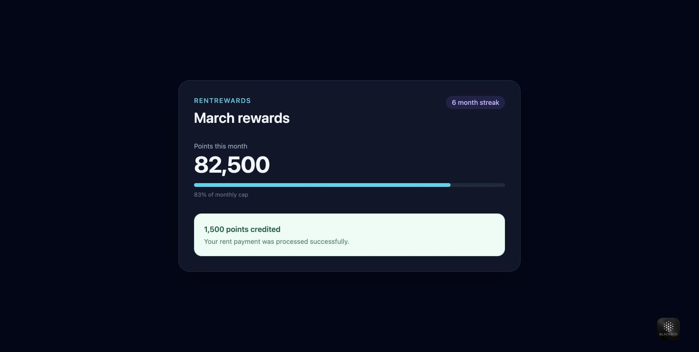
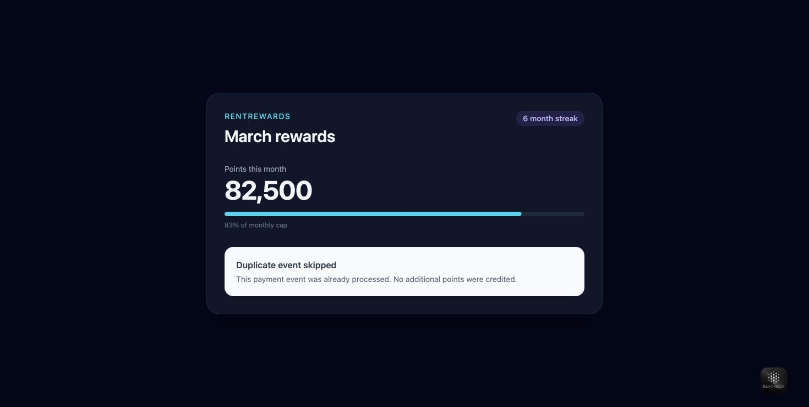
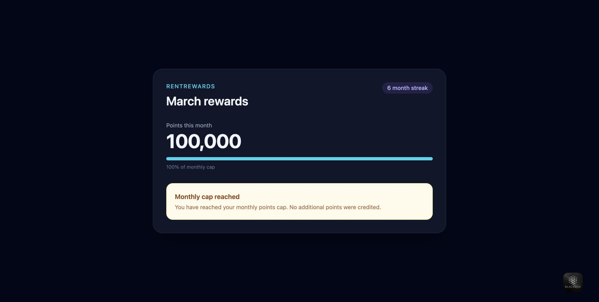
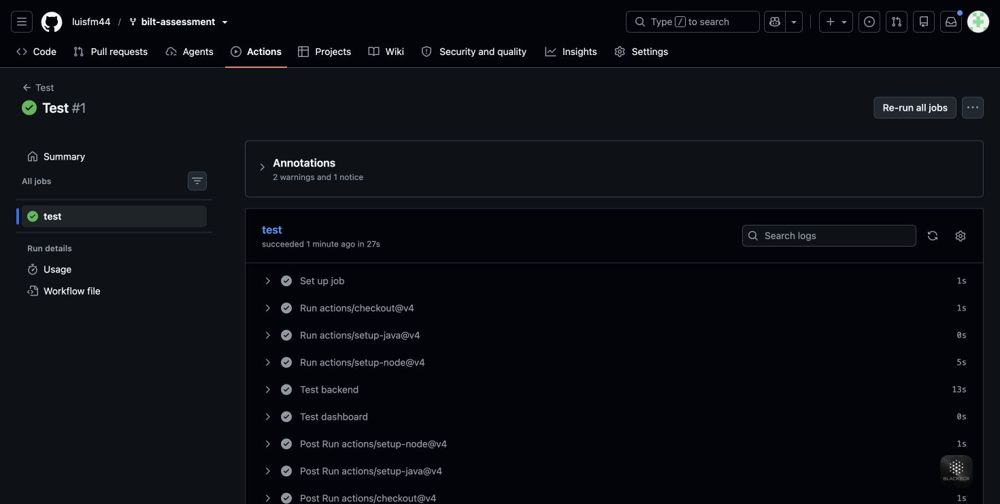

# Bilt Full-Stack Engineering Assessment

## Context

RentRewards is a rewards platform that lets members earn points on rent and
mortgage payments. Points can later be redeemed for travel, cash back, and
other perks — similar in spirit to how a credit card rewards program works,
but built specifically around housing payments.

Members' payments are processed by an external payment processor. Whenever a
payment goes through, the processor sends us a **webhook event**, and our
`RewardsEngine` calculates and awards points based on a few business rules.

## Business rules (already implemented)

- **Base rate:** 1 point per $1 paid.
- **Linked account bonus:** payments made from a bank account linked to
  RentRewards earn **2x** points.
- **Streak bonus:** members with 6+ consecutive months of on-time payments
  get an extra **10%** on top of their (already multiplied) points.
- **Monthly cap:** members can earn at most **100,000 points per calendar
  month**.

## The incident

**Our payment processor guarantees at-least-once delivery** of webhook
events. In practice, this means the same payment event can be delivered to
us more than once — usually due to network retries on their side, timeouts,
or their own infrastructure hiccups. When that happens, we must **not**
award points twice for the same payment.

We've had two related reports:

1. Some members occasionally receive points twice after webhook retries.
   Deliveries may arrive out of order or at the same time on different
   workers.
2. The rewards dashboard always announces that points were credited, even
   when an event was skipped as a duplicate or the monthly cap prevented an
   award.

## Your task

1. Run both existing test suites (see `SETUP.md`).
2. Diagnose and fix the idempotency bug. The same `eventId` must award
   points at most once, including when deliveries arrive out of order or
   overlap on different workers.
3. Drive the dashboard from `PointsResult.getOutcome()` in `web/dashboard.js`:
   - `AWARDED`: success;
   - `DUPLICATE`: neutral/skipped;
   - `CAPPED`: warning.
4. Keep all existing business rules and passing expectations intact.
5. Add or improve tests when they make your reasoning clearer.

You may use any AI coding tool you normally work with. You do not need to
submit prompts, transcripts, or an account of your AI usage.

## What we're looking for

We evaluate the observable engineering result:

- Correctness under out-of-order and concurrent duplicate deliveries.
- Correct UI state, copy, and visual tone for each outcome.
- Focused, readable changes with useful tests.
- Preservation of the existing business rules.

This exercise uses in-memory state by design. A production database or
distributed idempotency solution is outside the expected scope.

## Time box

Aim for **45 minutes** and stop after **60 minutes**. A focused partial
solution is preferable to a large rewrite.

## Submission

Fork this public repository, commit your changes, and share the URL of your
public fork. Please do not squash away the baseline history: evaluation is
limited to your diff from the original repository.

## Fix and validation

`ProcessedEventStore` retains every processed event ID. `RewardsEngine` locks
the shared store across duplicate checking, point calculation, monthly cap
enforcement, crediting and recording the event. Separate engines using the
same store therefore cannot credit an event twice or race past the monthly
cap. Capped events are also remembered. The calculator and reward rules are
unchanged.

The store-wide lock deliberately serializes processing for this small,
in-memory exercise. Workers must share the store; persistence across restarts
and coordination between separate processes remain outside its scope.

The dashboard maps `outcome` to success, neutral or warning copy and colors.
A partial award that reaches the cap still displays success.

Validation: `mvn test` passes 20 test executions (including the eight existing
concurrency repetitions); `npm run test:web` passes all 6 tests. Added coverage
includes separate engines sharing a store, concurrent distinct events at the
cap, capped-event retries, month rollover, retry after a failed calculation,
and rendered dashboard transitions.

## Validation evidence

Run `mvn test` and `npm run test:web` from the repository root to reproduce the
results. [Captured local test output](docs/evidence/test-results.txt) records
both passing suites. The [Test workflow](https://github.com/luisfm44/bilt-assessment/actions/workflows/test.yml)
also supports **Run workflow** for independent verification on Java 17 and Node 20.

[Verified GitHub run](https://github.com/luisfm44/bilt-assessment/actions/runs/37684382273)
passed all 20 backend test executions and all 6 dashboard tests on Java 17 and Node 20.

These screenshots use preview fixtures with the actual `renderDashboard`
function. They demonstrate UI copy and visual tone; backend correctness is
verified separately by the Java tests.

| AWARDED: success | DUPLICATE: neutral | CAPPED: warning |
| --- | --- | --- |
|  |  |  |

